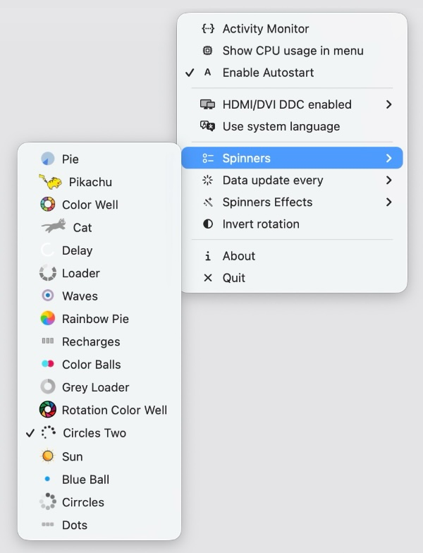
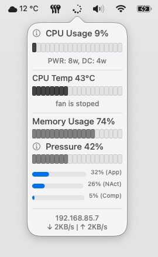

# System Spinner

System Spinner provides macOS system information in status bar. Minimal, small and light!

## Features

- Show CPU usage in system bar
- Audio and brightness external monitor contol (over HDMI/DVI/USB-C with standart keys)
- Top CPU/MEM process in popup window
- Memory statistics performance
- Network utilisation and ip address
- CMS Information for Cpu Temp and Fan
- Full MacOS 26 Tahoe Liquid Glass support
- Spinner overlay effects
- Localization (English, Japanese, Russian)

## Screenshots

  
## Tech
Written in Swift 5, Apple Silicon Only for MacOS 26 Tahoe, MacOS 15.6 Sequoia.

Thanks for language translate:
- Japanese by [@1024jp](https://github.com/1024jp)

Based on: [menubar_runcat](https://github.com/Kyome22/menubar_runcat), [stats](https://github.com/exelban/stats), [ActivityKit](https://github.com/Kyome22/ActivityKit), [MonitorControl](https://github.com/MonitorControl/MonitorControl), [MediaKeyTap](https://github.com/the0neyouseek/MediaKeyTap), [SimplyCoreAudio](https://github.com/rnine/SimplyCoreAudio), [swift-atomics](https://github.com/apple/swift-atomics)
