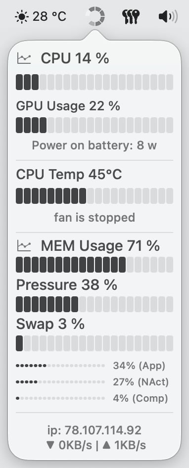
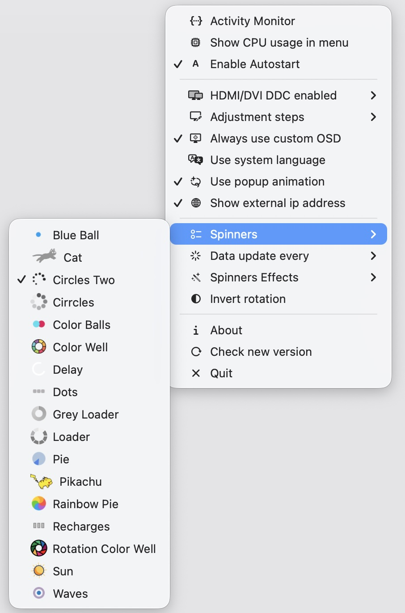
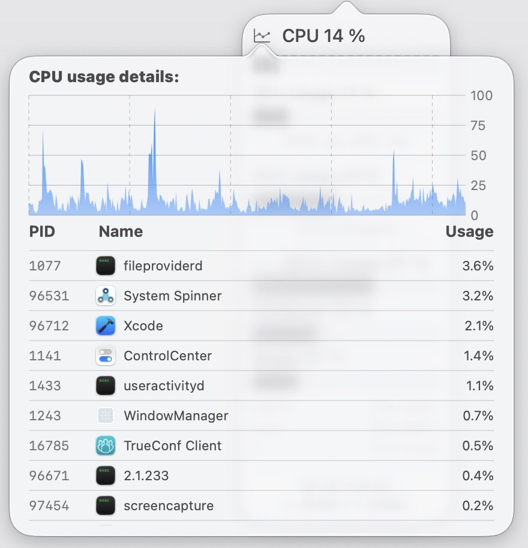

# System Spinner

System Spinner provides MacOS system information in status bar. Minimal, small and light!

This is the MacOS version, if you are looking for Windows go to [System Spinner x64](https://github.com/andrey-lysikov/System-Spinner-x64)

## Features

- Spinner speed follows the CPU and GPU load, whichever is higher
- Show the load in the status bar
- Animated and static spinners, with overlay effects
- Audio and brightness control for external monitors (over HDMI/DVI/USB-C with the standard media keys)
- Keyboard backlight control on F5/F6 (disable light sensor wen manual controll enabled)
- Smooth scrolling for non-Apple mice (a wheel scrolls by whole lines, this glides)
- Switching between desktops using advenced buttons 3 and 4 on Logitech mice
- Custom OSD in MacOS for volume and brightness control (with a switch)
- Custom adjustment steps (more accurate volume and brightness control, also "cmd" activates fine-tuning)
- Top CPU/MEM processes in popup window, with 10 top processes in detail
- Memory statistics with swap, and real used memory
- Network utilisation and external ip address (uses checkip.dyndns.org, you can turn off showing external ip)
- SMC information for CPU temp and fan (scanned automatics)
- Full MacOS Liquid Glass support
- Localization (English, Arabic, Chinese, French, German, Italian, Japanese, Russian)

*WARNING: The application is not officially signed, you will need to allow it to run in "Settings" -> "Security" when you first launch it.*

## Screenshots

  
  
  

## Tech
Written in Swift 6, Apple Silicon only, for MacOS 26 and newer

## Troubleshooting

If for some reason you don't see the temperature/battery and fan sensors, please run the diagnostics from the archive in the release, `system-diagnostic.zip`.
Unzip it to any folder and run it in a terminal:

    bash run-probe.sh

It writes `probe-<model>.tsv` — please attach that file to an [issue](https://github.com/andrey-lysikov/System-Spinner/issues).

Thanks for language translate:
- Japanese by [@1024jp](https://github.com/1024jp)

Based on: [Menubar_runcat](https://github.com/Kyome22/menubar_runcat), [Stats](https://github.com/exelban/stats), [MonitorControl](https://github.com/MonitorControl/MonitorControl), [Better-osd](https://github.com/zmlabs/better-osd), [Mos](https://github.com/Caldis/Mos)
